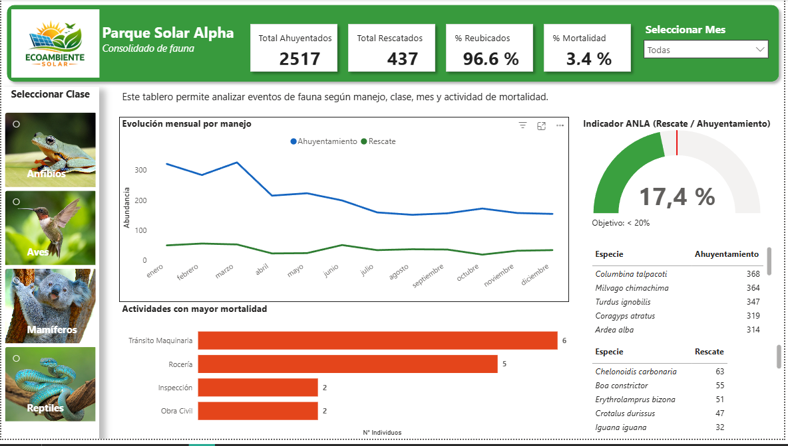

# 📊 Dashboard de Gestión de Fauna – Power BI

## 🎯 Objetivo

Analizar la gestión de fauna en proyectos ambientales, evaluando:

- Volumen de rescates y ahuyentamientos  
- Indicadores de reubicación y mortalidad  
- Cumplimiento del indicador ANLA  
- Especies y actividades críticas  

## 🧰 Herramientas utilizadas

- Power BI (visualización)  
- SQL (cálculo de KPIs)  
- Python (simulación de datos)  
- Excel (apoyo)  

## 📈 Principales insights

- La mayoría de individuos fueron gestionados mediante ahuyentamiento  
- La tasa de reubicación es alta (> 90%)  
- La mortalidad se concentra en actividades operativas específicas  
- Algunas especies concentran la mayor intervención  

## 📷 Vista del dashboard

## 📁 Estructura del proyecto

Este repositorio está organizado de la siguiente manera:

- **data/** → Datos fuente y archivos auxiliares (incluye `secciones.xlsx`)
- **pbix/** → Archivo del dashboard en Power BI  
- **sql/** → Consultas para cálculo de KPIs  
- **python/** → Scripts para generación y limpieza de datos  
- **images/** → Imágenes del dashboard para visualización en el README  

## 🧩 Archivo auxiliar (secciones)

Se utilizó un archivo adicional en Excel:

- **data/secciones.xlsx**

Este archivo contiene la relación entre la **clase taxonómica** y las **URLs de imágenes**, lo que permite construir un segmentador visual (slicer con imágenes) en Power BI.

### 🔗 Relación en el modelo de datos

- `registros[clase]` → `secciones[clase]`

### 🎨 Valor agregado

Este componente permite:
- Mejorar la experiencia de usuario  
- Facilitar la navegación visual del dashboard  
- Aportar un diseño más interactivo y profesional  

## 🚀 Cómo usarlo

1. Abrir el archivo `.pbix` en Power BI Desktop  
2. Actualizar datos si es necesario  
3. Explorar mediante filtros  
